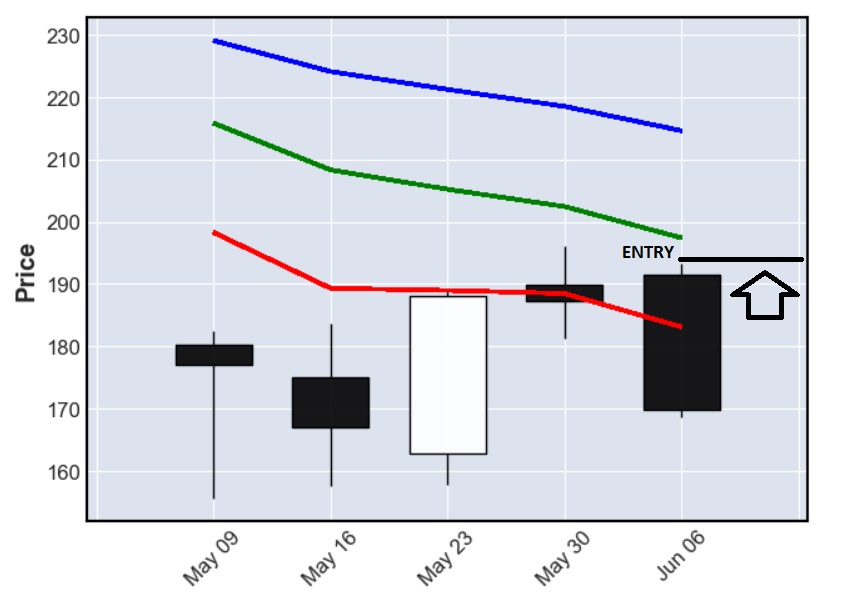

# NVDA-Stock-Price-Prediction-by-CNN-LSTM-DNN-model
<i>DISCLAIMER:
Bellow code is only for informative purpose, i renounce any responsibility regarding this code and trained model causing loss of money during trading on real market.</i>

<b>Stock price prediction : NVDA</b>

This page does following:

- load libraries and load stock data as dataframe 
- display chart with close price 
- add indicators to loaded dataframe 
- filter out formations and get its windows 
- Export data to csv file 

<b>Trading strategy</b> 
Trading chart: Daily 
Trade type: LONG 
Stock: NVDA 
Entry price: High price of previous week 
Exit price: Model predicts Highest high price of following month (4 weeks period) 

<b>Trading Data</b> 
We are loading weekly data from yahoo finance. We are preprocessing dataset in following order - 5 candle formation (representing 5 weeks) + 1 monthly candle as label (following 4 weeks period). Bellow code will preprocess data in such order, 6th candle in window is always a monthly candle.

<b>**monthly candle is not calendar month, it is 4 weeks period that is followed by our 5 candle formation</b>

Trading method is following:

- We are trading upper trend
- We are waiting for correction, when price drops bellow exponential moving averages
- We are waiting for a moment when ema6 is bellow ema12
- We are openning trade on the previous week High price after formation is formed

<b>Traded formation</b> 
Condition 0: Last candle close is lower than EMA6 
Condition 1: EMA6 is lower than EMA12  

We are getting windows from stock dataset, each window has 6 rows (6 candles), 5 rows (formation) + 1 row (label). Our above condition is using only last two candles from formation, however model will be trained on 5 candles, please refer to image bellow.

